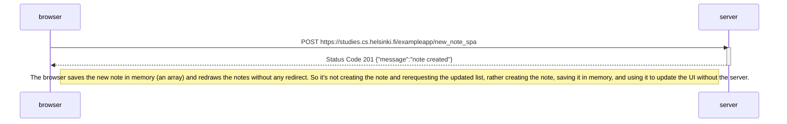

```mermaid
sequenceDiagram
    participant browser
    participant server

    browser->>server: POST https://studies.cs.helsinki.fi/exampleapp/new_note_spa
    activate server
    server-->>browser: Status Code 201 {"message":"note created"}
    deactivate server

    Note right of browser: The browser saves the new note in memory (an array) and redraws the notes without any redirect. So it's not creating the note and rerequesting the updated list, rather creating the note, saving it in memory, and using it to update the UI without the server.
```