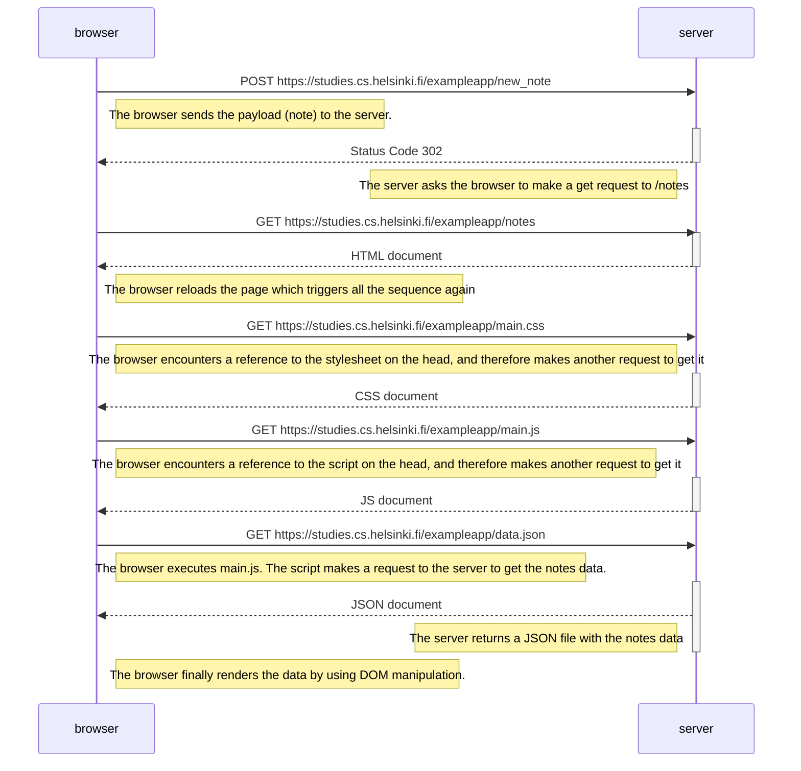

```mermaid
sequenceDiagram
    participant browser
    participant server

    browser->>server: POST https://studies.cs.helsinki.fi/exampleapp/new_note 
    Note right of browser: The browser sends the payload (note) to the server.
    activate server
    server-->>browser: Status Code 302
    deactivate server
    Note left of server:  The server asks the browser to make a get request to /notes

    browser->>server: GET https://studies.cs.helsinki.fi/exampleapp/notes
    activate server
    server-->>browser: HTML document
    deactivate server

    Note right of browser: The browser reloads the page which triggers all the sequence again

    browser->>server: GET https://studies.cs.helsinki.fi/exampleapp/main.css
    Note right of browser: The browser encounters a reference to the stylesheet on the head, and therefore makes another request to get it
    activate server
    server-->>browser: CSS document
    deactivate server

    browser->>server: GET https://studies.cs.helsinki.fi/exampleapp/main.js
    Note right of browser: The browser encounters a reference to the script on the head, and therefore makes another request to get it
    activate server
    server-->>browser: JS document
    deactivate server

    browser->>server: GET https://studies.cs.helsinki.fi/exampleapp/data.json
    Note right of browser: The browser executes main.js. The script makes a request to the server to get the notes data.
    activate server
    server-->>browser: JSON document
    Note left of server: The server returns a JSON file with the notes data
    deactivate server

    Note right of browser: The browser finally renders the data by using DOM manipulation.
```